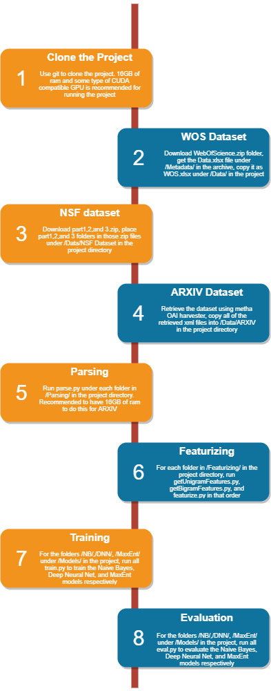

# CMSC 473 Project
## Jacob Barnett, Steve Calderon, Nimit Patel

This github repo contains code for our cs473 group project in which our team chose to evaluate the performance of Naive Bayes, MaxEnt, and Deep Neural Net models for the task of research paper classification for the Web Of Science(WOS) dataset located at https://data.mendeley.com/datasets/9rw3vkcfy4/6, 
the NSF Research Award Abstracts 1990-2003 Data Set located at: https://archive.ics.uci.edu/ml/datasets/NSF+Research+Award+Abstracts+1990-2003, and the ARXIV research paper database metadata used as a dataset pulled down using metha OAI harvester located at https://github.com/miku/metha. 

If you wish to be able to run any arbitrary python script within the project without having to first retrieve the datasets and run through the project's pipeline, you can download this file https://drive.google.com/file/d/15JzTPMWe5nHKKLn7v_2TBCvDe3sYAiMV/view?usp=sharing and extract it. Otherwise, you will have to run through each step in the pipeline for the project described in the picture below:

Format: 
